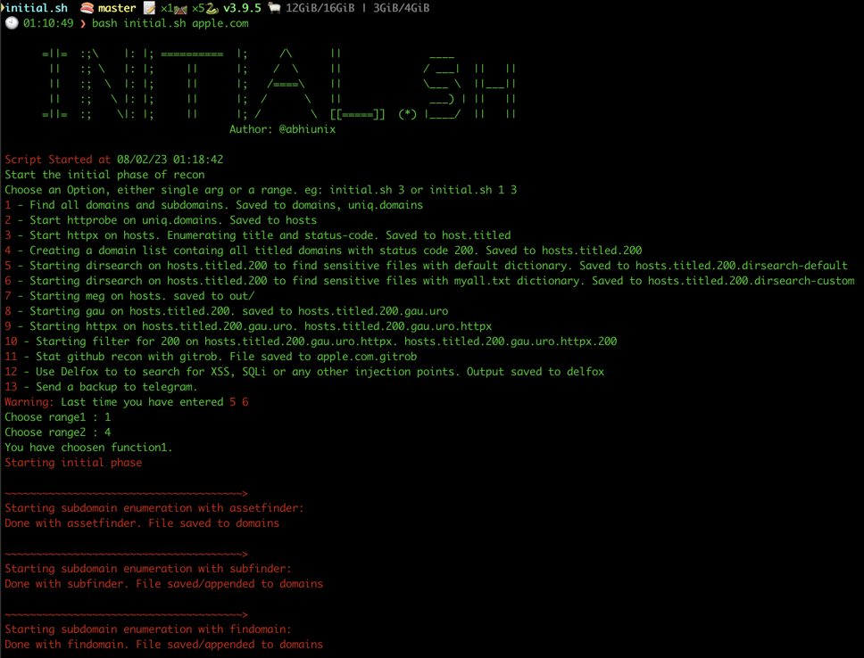

# initial.sh provides a list of options for initial recon on a target. 

Tools integrated:
1. notify
2. assetfinder
3. subfinder
4. findomain
5. crtsh
6. httpx
7. httprobe
8. dirsearch.py
9. meg
10. gau
11. uro
12. gitrob

# Run the script:
```
chmod +x initial.sh
./initial.sh apple.com
```
